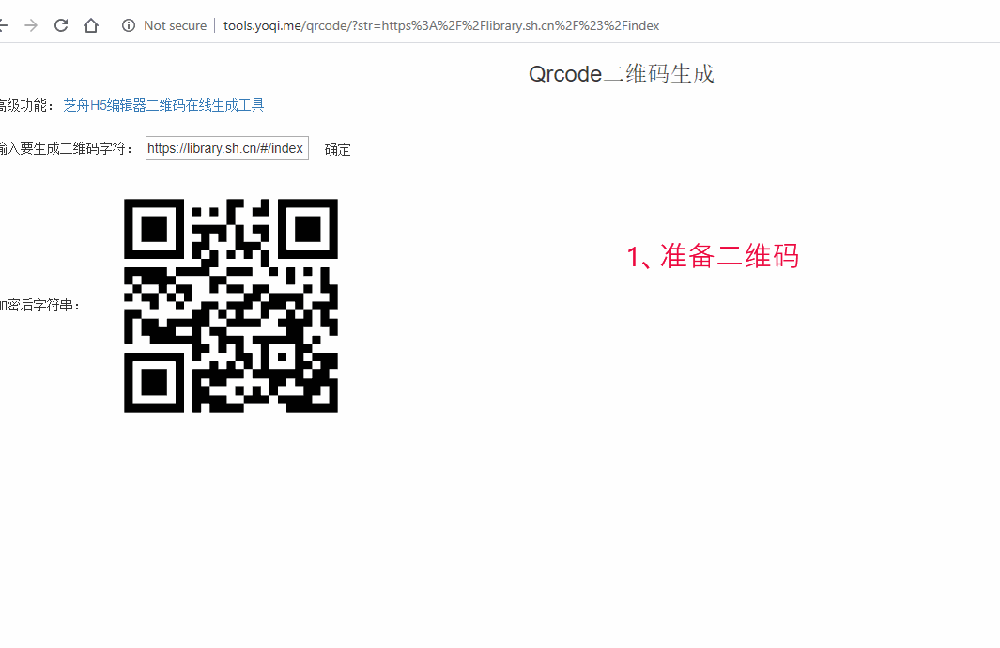

## 小舟PC二维码识别

电脑上二维码一般通过手机扫码打开，但是我更想实现电脑上直接解析二维码查看内容（干嘛还要哪个手机扫）。于是就有了开发这个项目的初衷。

该项目基于 树洞 OCR 文字识别魔改，实现 windows/mac/linux 二维码识别。

windows 版我已经打包 exe，双击即可打开，到 release 中下载即可。linux 和 mac 编辑 ~/.bash，添加快捷启动即可。

qq群： 1102981858

## 程序使用
### 启动截图
- 方法一：在程序主界面点击截图按钮；
- 方法二：点击截图快捷键 F4。
